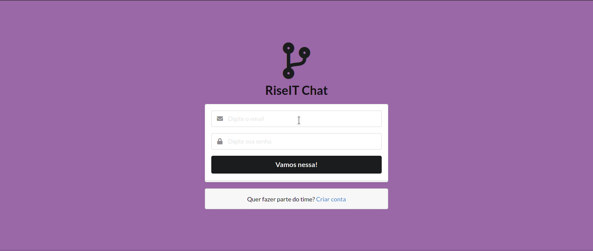
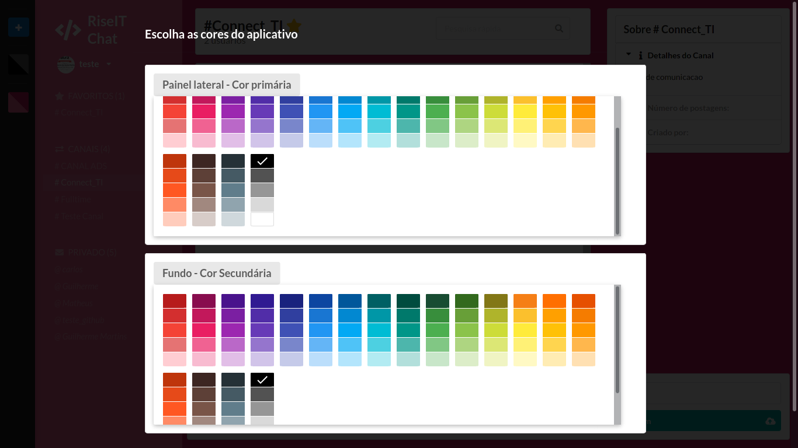
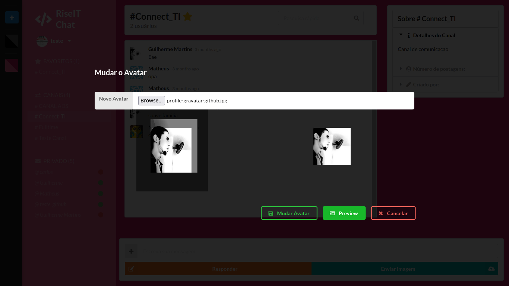
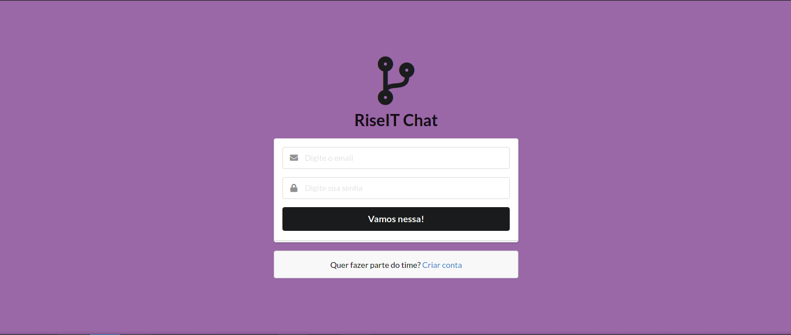
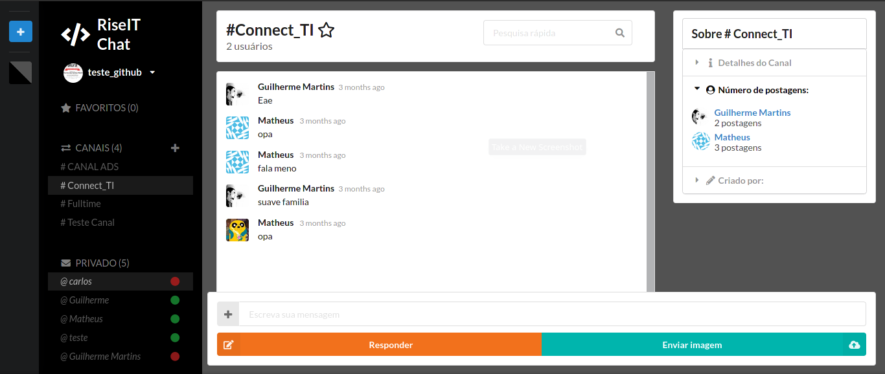

<p align="center">
  <h1 align="center" >Realtime chat with Firebase and React </h1>
</p>

## 🧪 How does it work? Check it out!

<p align="center">
  
</p>

<br>

## 🧪 Technologies

This project was developed using the following technologies:

- [React](https://reactjs.org)
- [Firebase](https://firebase.google.com/)
- [React Semantic UI](https://react.semantic-ui.com/)


## 🚀 Getting started

Clone the project and access the folder.

The public URL can be found here: 

*Deployed version:* https://react-slack-clone-redux.web.app


Local React.js development server:

```bash
$ git clone https://github.com/g-santosmartins/react-slack-clone.git

```
Enter by using the CD command if you will and then: 

Follow the steps below:
```bash
# Install the dependencies
$ yarn

or 

$npm (v14.0.0 or older) 

Use NVM, if you will

# Start the project
$ yarn start

$npm install

```
The app will be available for access in your browser at http://localhost:3000


## IMPORTANTE: You will need a database to use the realtime database:

Access: https://firebase.google.com/?hl=pt-br

## 🧪 New features

Layout color change was implemented to supply user will of chaging default colors:


<p align="center">
  
</p>

Chaging photo at profile area by using gravatar public API and firebase to persist the data:

<p align="center">
  
</p>


## 🔖 Layout

You can view the project layout here:

<p align="center">
  
</p>

<p align="center">
  
</p>


## 📝 License

This project is licensed under the MIT License. See the [LICENSE](LICENSE.md) file for details.

---

<p align="center">Made with ❤️ by Guilherme Martins</p>
